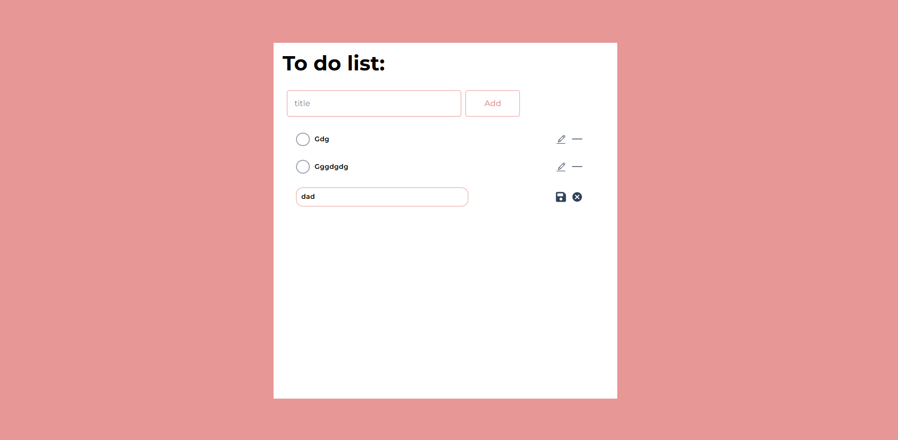

## 📋 To-Do List Application

This is a simple and user-friendly **To-Do List Application** built using **React.js** and **Tailwind CSS**. It allows you to **add, edit, mark as complete, delete tasks**, and automatically moves completed tasks to the bottom.

## 📸 Application Preview

Here is how the To-Do List Application looks:



## ✨ Features

- ✅ **Add New Task**
- ✅ **Mark Task as Completed**
- ✅ **Edit Existing Task**
- ✅ **Delete Task**
- ✅ **Reorder Completed Tasks to the Bottom**
- ✅ **Beautiful Circular Checkbox with Pink Background**
- ✅ **Smooth User Experience with Tailwind CSS**

---

## 📂 Project Setup

Follow the instructions below to run the project on your local machine.

### 💻 Prerequisites

- Node.js (v18 or higher)
- npm or pnpm
- Vite.js

---

## 🚀 Getting Started

### 1. Clone the Repository

```bash
git clone https://github.com/Aditya-Deshmukh9/To-Do-List-application-React
cd To-Do-List-application-React
```

### 2. Install Dependencies

```bash
npm install
```

or

```bash
pnpm install
```

### 3. Run the Application

```bash
npm run dev
```

### 4. Open in Browser

After running the above command, open your browser and visit:

```
http://localhost:5173
```

---

## 🎨 UI Preview

- ✅ Circular checkbox with pink background and white checkmark.
- ✅ Tasks automatically shift completed tasks to the bottom.
- ✅ Smooth transition and clean UI using Tailwind CSS.

---

## 💾 Project Structure

```
src
│
├── components
│   ├── Header.jsx
│   ├── ToDoList.jsx
│   ├── ToDoItem.jsx
│
├── App.jsx
├── main.jsx
└── index.html
```

---

## 🔥 Technologies Used

- **React.js** (with hooks)
- **Tailwind CSS** (for styling)
- **Vite.js** (for fast build)

---

## 🗑 Delete Task

Simply click the ❌ **Delete** button beside any task to remove it.

---

## ✍ Edit Task

Click the **Edit** button, modify your task, and press **Save**.

---

## ✅ Mark as Completed

Click the **circular checkbox** to mark a task as completed. The task will automatically move to the bottom.

---

## 🤝 Contributing

Contributions are always welcome!  
If you'd like to add new features, improve the code, or fix any bugs, feel free to fork the repository and submit a pull request.

---

## 📜 License

This project is licensed under the **MIT License**.

---

## 📬 Contact

For any queries or suggestions, feel free to contact me at:  
📧 Email: [your-email@gmail.com](mailto:adityadesh937@gmail.com)  
😊 Portfolio: [aditya_deshmukh](https://adityadeshmukh.online)

💻 GitHub: [AdityaDeshmukh9](https://adityadeshmukh.online/github)

---

🔥 **Happy Coding! 🚀**
